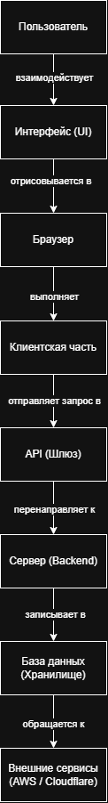

\# Анализ информационной системы

\## 1. Описание системы

Название: Notion

Ссылка: https://notion.so

Назначение: SaaS-сервис для создания текстовых документов, баз данных и управления информацией.

Целевая аудитория: студенты, ИТ-специалисты, дизайнеры и команды, которым нужно организовать совместную работу.

Основные возможности: создание вложенных страниц, добавление текстовых и медиа-блоков, таблиц, kanban-досок, списков задач.

Выбранный сценарий: создание страницы и добавление блока.

\## 2. Анализ пользовательского интерфейса

Ключевые элементы интерфейса Notion:

\* Боковая панель (навигация по страницам);

\* Рабочая область (редактор страницы);

\* Кнопка "New page" (создание новой страницы);

\* Всплывающее меню блоков (выбор типа контента).

\*\*Описание сценария:\*\*

1\. Пользователь нажимает кнопку "New page" на боковой панели.

2\. Вводит название страницы в рабочей области.

3\. Нажимает на иконку '+' и выбирает нужный блок (например, Text или To-do list) из выпадающего меню.

\*\*Скриншоты выполнения:\*\*

!\[Создание страницы](images/step1.png)

!\[Добавление блока](images/step2.png)

\## 3. Анализ клиентской части системы

\*\*Анализ HTML/CSS (вкладка Elements):\*\*

!\[Elements](../images/screenshots/step3\_elements.png)

Интерфейс построен с использованием древовидной структуры HTML-тегов (преимущественно `div`). Для стилизации применяются динамически сгенерированные CSS-классы, которые обеспечивают гибкую верстку (Flexbox) и темную/светлую тему.

\*\*Анализ сетевых запросов (вкладка Network):\*\*

!\[Network](../images/screenshots/step3\_network.png)

| Метод | Запрос | Назначение | Формат данных |

| --- | --- | --- | --- |

| POST | `/api/v3/saveTransactions` | Сохранение нового блока/текста в базу данных на лету. | JSON |

| POST | `/api/v3/queryCollection` | Запрос данных для отображения содержимого базы/страницы. | JSON |

| POST | `/api/v3/ping` | Проверка статуса соединения с сервером. | JSON |

При выполнении сценария (создание блока) клиентская часть формирует пакет данных о новом элементе и отправляет POST-запрос на сервер для фонового сохранения.

## 4. Анализ серверной части и API

Так как прямого доступа к бэкенду нет, архитектура предполагается на основе сетевых запросов и принципов работы SaaS-платформ.

* **Операции на сервере:** Обработка текстового ввода, синхронизация изменений в реальном времени между устройствами, проверка прав доступа к страницам, ведение истории версий (версионирование).
* **Передаваемые данные:** JSON-объекты, содержащие уникальные идентификаторы (block ID), тип контента, текстовое содержимое и временные метки.
* **Внешние сервисы:** AWS (Amazon Web Services) для облачного хостинга, Cloudflare для защиты и кэширования (CDN), сервисы телеметрии.
* **Предполагаемые хранилища:** Реляционные базы данных (например, PostgreSQL) для хранения структуры страниц и текста, а также объектные хранилища (S3) для загруженных пользователями картинок и файлов.
* **Роли компонентов:**
  * *Клиент (Браузер/Приложение):* Отрисовывает интерфейс, собирает клики и ввод, отправляет запросы.
  * *API:* Служит мостом, принимает запросы от клиента и распределяет их по внутренним службам.
  * *Сервер (Backend):* Выполняет бизнес-логику, проверяет авторизацию, управляет сохранением.
  * *Хранилище (База данных):* Обеспечивает персистентное (постоянное) хранение всей информации воркспейса.

## 5. Описание пользовательского сценария

Сценарий: Создание страницы и добавление блока.

1. **Пользователь выполняет действие:** Нажимает кнопку "New page", вводит заголовок и через символ `/` выбирает нужный блок (например, Text).
2. **Интерфейс обрабатывает действие:** Браузер мгновенно отрисовывает новый блок на экране (подход Optimistic UI), создавая ощущение моментального отклика.
3. **Клиентская часть формирует запрос:** Клиент собирает данные о новом блоке в JSON-пакет и отправляет POST-запрос на endpoint `/api/v3/saveTransactions`.
4. **Сервер выполняет обработку:** Backend получает запрос, валидирует данные и проверяет права на запись в текущем пространстве.
5. **Данные сохраняются:** Сервер записывает обновленную структуру документа в базу данных.
6. **Интерфейс отображает результат:** Сервер возвращает ответ об успешном сохранении. Состояние страницы окончательно синхронизировано.

## 6. Построение архитектурной схемы

**Вывод:**
В ходе выполнения лабораторной работы была проанализирована архитектура SaaS-сервиса Notion. Изучены механизмы взаимодействия клиентской части (браузера) с сервером через API, проанализированы сетевые запросы при сохранении данных (POST-запросы), а также построена общая архитектурная схема информационной системы.
